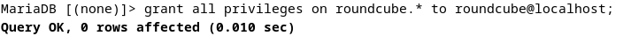
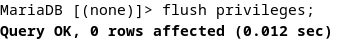
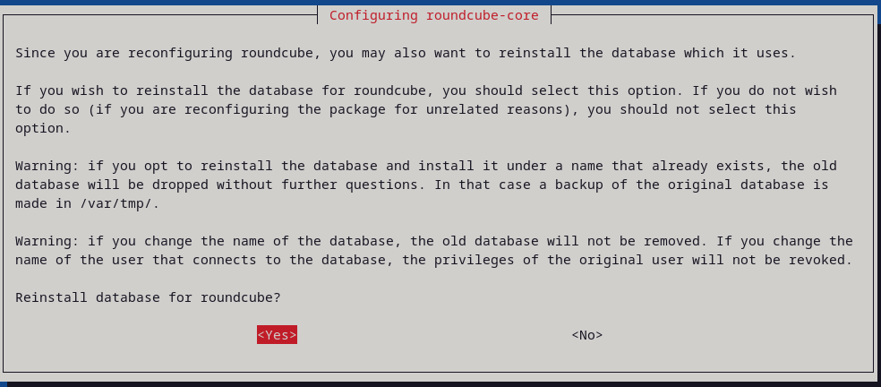
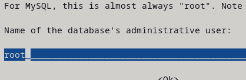

# Mail Server dan Local Domain

### Daftar Isi
- [Mail Server dan Local Domain](#mail-server-dan-local-domain)
    - [Daftar Isi](#daftar-isi)
    - [A. Persiapan](#a-persiapan)
    - [B. Setup NTP ( Network Time Protocol )](#b-setup-ntp--network-time-protocol-)
    - [C. Install Web Server ( APACHE2 + PHP-FM )](#c-install-web-server--apache2--php-fm-)
      - [+  Install Apache2](#--install-apache2)
      - [+ Install PHP 8.2](#-install-php-82)
      - [+ Install PHP FM](#-install-php-fm)
    - [D. Install Database server ( Mariadb-Server )](#d-install-database-server--mariadb-server-)
      - [E. Install POSTFIX mailserver (SMTP Server)](#e-install-postfix-mailserver-smtp-server)
    - [F. Install DOVECOT (IMAP POP3)](#f-install-dovecot-imap-pop3)
    - [G. DEBIAN EVOLUTION](#g-debian-evolution)
    - [H. ROUNDCUBE](#h-roundcube)

### A. Persiapan

1. Setup terlebih dahulu mail server pada konfigurasi zone sehingga dapat di resolve ```mail.kelompok2.local```

    > 
    > forward

    >
    > inverse

2. nslookup

    > 


### B. Setup NTP ( Network Time Protocol )

1. Installasi Paket dengan command ``sudo apt install systemd-timesyncd``

2. Ubah TimeZone ke Asia/Jakarta

3. Buat RTC menjadi sama dengan UTC

4. Aktifkan NTP supaya waktu Sinkron

    > 

5. Ubah config file ``timesync.d``, buat pool ke terdekat supaya delay jadi pendek.

    > 

    > List NTP Indonesia https://www.ntppool.org/zone/id

6. Restart Service yang berjalan dan cek statusnya

    > 

7. Cek Tanggal

    > 

### C. Install Web Server ( APACHE2 + PHP-FM )

#### +  Install Apache2
1. Install paket dengan command berikut ``sudo apt -y install apache2``


2. Ubah ServerToken Menjadi Prod gunakan Text Editor seperti Nano

    > 
    > sudo nano /etc/apache2/conf-enabled/security.conf

3. Tambahkan Directory yang dapat diakses

    > 
    > sudo nano /etc/apache2/mods-enabled/dir.conf

4. Tambahkan ServerName

    > 
    > sudo nano /etc/apache2/apache2.conf

5. Webmaster email

    > 
    > sudo nano /etc/apache2/sites-enabled/000-default.conf

6. Reload service apache2


7. Cek apakah webserver berjalan pada browser kita

    > 

#### + Install PHP 8.2

1. Install dengan perintah berikut


    > sudo apt -y install php8.2 php8.2-mbstring php-pear

2. Cek apakah sudah terinstall
   > php -v


3. Buat sebuah file php untuk memeriksa apakah PHP Berjalan/Fungsi

    > 

4. Jalankan

    > 


#### + Install PHP FM

1. Install dengan perintah berikut

    > sudo apt -y install php-fpm

2. Lakukan Konfigurasi pada file apache untuk PHP-FM

    > 
    > sudo nano /etc/apache2/sites-available/default-ssl.conf

3. setenvif pada ae2enmod proxy_fcgi
4. load config

    > 

5. Jalankan ulang Servicenya 

    > 

6. Test kedalam webserver, buat file info.php

    > 
    > sudo echo '<?php phpinfo(); ?>' > /var/www/html/info.php

7. cek pada web

    > .png>)
    > berhasil


### D. Install Database server ( Mariadb-Server )

1. Install paket dengan perintah berikut


    > sudo apt -y install mariadb-server

2. Pastikan atau ubah charset ke utf8mb4, lalu restart service mariadb

    > 
    > sudo nano /etc/mysql/mariadb.conf.d/50-server.cnf

3. Lakukan installasi dengan perintah ``sudo mysql_secure_installation``


    Installasi pattern

    
       Enter current password for root (enter for none): Tekan Enter

       Switch to unix_socket authentication [Y/n] n

       Change the root password? [Y/n] n

       Remove anonymous users? [Y/n] y

       Disallow root login remotely? [Y/n] y

       Remove test database and access to it? [Y/n] y

       Reload privilege tables now? [Y/n] y

    Pastikan sama sehingga langkah tetap sama.

4. Masuk kedalam mysql perintah    `mysql`

    > 

5. Cek akses user root

    > 

6. Cek daftar user pada database user

    > 

7. Lihat semua database

    > 

8. Berarti mysql sudah terinstall, coba buat sebuah dummy database dan table untuk menjalankan beberapa query crud

    > 

9. Berhasil dan Database mariadb sudah terinstall.


#### E. Install POSTFIX mailserver (SMTP Server)

1. Install dengan perintah ``sudo nano apt -y install postfix sasl2-bin``
2. Pilih yang No Configuration ( kita config manual )
    > .png>)

3. Copy file config /usr/share/postfix/main.cf.dist ke /etc/postfix/main.cf


4. Ubah beberapa Konfigurasi pada file postfix main.cf

    > .png>)
    > .png>)
    > .png>)
    > .png>)
    > .png>)
    > .png>)
    > .png>)
    > .png>)
    > .png>)
    > .png>)
    > .png>)

5. Tambahkan config anti spam
    > .png>)


### F. Install DOVECOT (IMAP POP3)

1. Gunakan Perintah berikut untuk installasi `sudo  apt -y install dovecot-core dovecot-pop3d dovecot-imapd`

    > 


2. Ubah listen IP
    > .png>)

3. Setting file auth   

    > .png>)

4. Konfigurasi file mail

    > .png>)

5. Terakhir tambahkan mode 0666, dan user,group postfix pada file master

    > .png>)

6. Restart service, dan cek di netstat

    > .png>)


### G. DEBIAN EVOLUTION

1. Buat User Terlebih dahulu disini kita buat user default kita di saya yaitu
``user``

    > Identitiy : username@mail.kelompok2.local

    > Recieve ( Port 993 )

    > Sending ( Port 25 )

1. user telah dibuat sekarang buat user lagi (dummy) untuk saya, ``ali`` dengan langkah yang sama. adduser terlebih dahulu
    > .png>)

2. Mengirim pesan

    > 

3. cek Inbox user `ali`


### H. ROUNDCUBE

1. Sebelum itu kita perlu melakukan Konfigurasi untuk user roundcube, tambahkan pada tabel db user

    > 

2. Berikan full access

    > 
    
    Load
    > 

3. Install Roundcube paket dengan perintah berikut

    > 

4. Pilih Yes
    > 

5. Masukkan password tadi ( 123 )

    > 

6. Lakukan config pada file `/etc/roundcube/config.inc.php`

7. Samakan dengan config berikut
    > 
8. Kemudian konfigurasi file apache pada roundcube, uncomment line 3 dan hapus public_html path

    > 

9. pada apache2 default conf tambahkan Servername untuk mail dan document root menjadi roundcube ``sudo nano /etc/apache2/sites-available/000-default.conf``, Servername mail.kelompok2.local DocumentRoot /var/lib/roundcube/
    
    > 

10. jalankan rekonfigurasi seperti berikut

    > 
    
    Ok

    > 

    en_Us

    > 

    Pilih Install ulang ( YES 
    
    > 

    Pilih TCP IP

    > 

    Pilih localhost

    > 

    Port 3306

    > 

    Pilih native password

    > 

    Database name default

    > 

    Username default

    > 

    Password 123

    > 

    Admin root

    > 

    Pilih webserver apache2

    > 

    Restart dan keep curently installed

11. Roundcube terinstall

    > 
